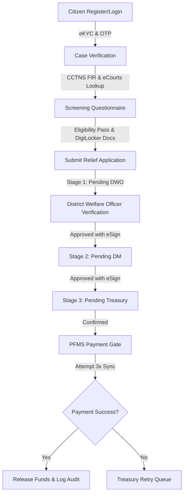

# SPARSH - Secure Platform for Authenticated Relief Settlements & Handoffs

> [!CAUTION]
> **STRICT WARNING OF USE: PROPRIETARY & CONFIDENTIAL**  
> **THIS SOFTWARE AND THE ACCOMPANYING FILES ARE STRICTLY PROPRIETARY AND THE SOLE PROPERTY OF DUSHYANT SINGH. ALL RIGHTS RESERVED.**  
> **UNAUTHORIZED USE, COPYING, REPRODUCTION, TRANSMISSION, SHARE, DISTRIBUTION, MODIFICATION, DECOMPILATION, OR REVERSE-ENGINEERING OF THIS CODEBASE OR ANY PART OF IT IS STRICTLY PROHIBITED AND SUBJECT TO SEVERE LEGAL PENALTIES.**  
> **NO LICENSE, EXPRESS OR IMPLIED, IS GRANTED. ACCESS TO AND USE OF THIS REPOSITORY IS ONLY PERMITTED UNDER THE EXPRESS, WRITTEN AUTHORIZATION OF THE COPYRIGHT OWNER.**

---

SPARSH is a web-based, human-in-the-loop Direct Benefit Transfer (DBT) system designed to digitize and streamline the lifecycle of relief claims under two Indian laws:
*   **The Protection of Civil Rights (PCR) Act, 1955**
*   **The Scheduled Castes and Scheduled Tribes (Prevention of Atrocities / PoA) Act, 1989**

The platform secures delivery through automated eKYC verification, deterministic case-matching, stage-wise officer workflows, and a tamper-evident audit log.

---

## 1. Directory Structure

```text
/
├── "backend/"                   # Express REST API Server
│   ├── "data/"                  # Mock government registry data dumps (Aadhaar, CCTNS, eCourts)
│   └── "src/"
│       ├── "config.ts"          # Environment configuration & .env loading
│       ├── "index.ts"           # Server bootstrap (DB init -> Seed -> HTTP Port Listen)
│       ├── "db/"                # Pool connection, schema definitions, and seed scripts
│       ├── "http/"              # Route controllers (Auth, Citizen, Official, Analytics)
│       └── "layers/"            # Core business logic separated by architectural concern
│           ├── "layer0-access/"       # Authentication, JWT handling, QR & 2FA OTP verification
│           ├── "layer1-ingestion/"    # CCTNS, eCourts & eKYC verification adapters
│           ├── "layer2-workflow/"     # Stage workflows, SLA trackers, escalations
│           ├── "layer3-disbursement/" # PFMS disbursement gateway and retry queues
│           ├── "layer4-audit-grievance/" # SHA-256 append-only audit chaining & grievances
│           └── "layer5-analytics/"    # KPI metrics and open-data computations
│
├── "frontend/"                  # React Single Page Application (SPA)
│   ├── "public/"                # Static assets (emblems, landing icons)
│   └── "src/"
│       ├── "main.tsx"           # Application entry point
│       ├── "App.tsx"            # Routes, guard routing, and layout shells
│       ├── "api/"               # Fetch API client and response type declarations
│       ├── "components/"        # Shared components (ESign signature pads, toast notification providers)
│       └── "pages/"             # Citizen pages (Overview, Case Apply) & Officer pages (Dash, Treasury, Audit)
│
├── "start.bat"                  # One-command startup script for Windows
├── "start.sh"                   # One-command startup script for macOS/Linux
└── "package.json"               # Monorepo NPM workspace scripts
```

---

## 2. Core Functional Flow



### Flow Walkthrough:

1.  **Identity Verification**: Citizens register/login. The platform performs Aadhaar eKYC validation. No passwords or citizen databases are hardcoded; all data is derived from encrypted mocks.
2.  **Case Pull**: The citizen inputs a Case or FIR number. The platform queries CCTNS (Criminal Tracking Network) and eCourts to verify the FIR details and victim status.
3.  **Application Intake**: Citizens answer a dynamically generated eligibility questionnaire and attach documents fetched from DigiLocker. The system blocks duplicates and invalid screenings at the entry gate.
4.  **Verification Workflow**:
    *   **DWO (District Welfare Officer)**: Reviews documents, validates details, and signs off using an SVG-based eSign pad.
    *   **DM (District Magistrate)**: Receives the application post-DWO approval and authorizes the relief payout.
    *   **Treasury**: Confirms the DM authorization, updates district budget allocations, and commits the transaction to the payout gateway.
5.  **Disbursement**: The platform calls the PFMS (Public Financial Management System) gateway. Synced failures automatically stack into a queue for manual retry by Treasury officers.
6.  **Audit Ledger**: Every transaction, sign-off, rejection, or edit is serialized and appended to a SHA-256 hash-chain (where each block carries the hash of the preceding block), assuring absolute audit integrity.

---

## 3. Tech Stack

*   **Frontend**: React 18, Vite 6, TypeScript, Tailwind CSS, Lucide icons
*   **Backend**: Node.js, Express 4, TypeScript, `pg` (node-postgres)
*   **Database**: PostgreSQL (strict SSL enabled)
*   **Testing**: Vitest, Supertest

---

## 4. Getting Started

### Prerequisites
*   Node.js (v18 or higher)
*   A running PostgreSQL instance (Local or Remote)

### Local Configuration
1. Clone the repository.
2. Create a `.env` file in the root directory by copying the example:
   ```bash
   cp .env.example .env
   ```
3. Open `.env` and fill in your connection credentials:
   ```env
   DATABASE_URL=postgres://<USER>:<PASSWORD>@<HOST>:<PORT>/<DATABASE>?sslmode=require
   PGSSLMODE=require
   ```

### Installation & Run

1.  **Install dependencies**:
    ```bash
    npm run setup
    ```

2.  **Start application**:
    *   **Windows**: Run `start.bat`
    *   **Linux/WSL/macOS**: Run `./start.sh`

    This script validates environment configs, runs safe database initializations and seed operations (if empty), and launches both backend (:4000) and frontend (:5173) dev servers concurrently.

---

## 5. License & Proprietary Rights

**© 2026 Dushyant Singh. All rights reserved.**

This software is strictly proprietary. No license is granted to the public or any third party.
*   **No unauthorized use**: No individual or entity is permitted to use, copy, reproduce, modify, translate, distribute, publish, or reverse-engineer this source code or compiled output.
*   **Strictly private**: Any use, execution, deployment, or modification of this codebase requires explicit, written permission from the copyright owner.
